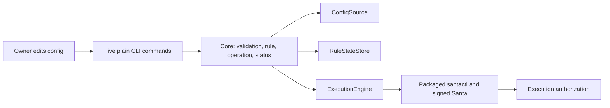

# Architecture

This page describes the layers every app cut from this template starts with, how they
talk, and what is contract. What an app decides on top of them — where it keeps state,
its dependencies, the platforms it targets, the permissions it asks for, whether it
ever ships releases — is recorded as ADRs under [`docs/architecture/`](architecture/README.md), whose
`README.md` is the index. The reasoning behind the layers themselves is the README's
[Design Philosophy](../README.md#design-philosophy).

## CommandFence design proposal

Status: Proposed, 2026-10-02. This section describes the intended product; the layers
below still document the implemented template scaffold. The five product commands,
owned-rule storage, and Santa enforcement have not been implemented or verified.
Scope is fixed by the [requirements](product/requirements.md); acceptance of an ADR
does not authorize installation, OS grants, or a live rule change.

### Principles and shape

- Generate one literal execution rule from captured configuration. No shell parsing,
  arbitrary CEL, automatic reload, or implicit home substitution.
- Santa owns execution authorization. CommandFence owns configuration and explicit
  operations; it adds no service, system extension, or direct Endpoint Security client.
- Decide in core; perform I/O in adapters. Keep the current workspace, hooks, platforms
  used by CI, lint levels, and coverage floors.
- Require affirmative evidence before a mutation. Missing data is uncertainty, and a
  successful submission is different from verified registration or observed denial.
- Preserve policy outside the one owned identity. Stop on conflicts; retain evidence
  instead of retrying or restoring a whole database.



Module paths and port names below are proposed implementation homes, not current APIs.

| Responsibility | Home | Boundary |
|---|---|---|
| Config v1 validation and deterministic rule generation | `command-fence-core/src/config.rs`, `rule.rs` | Bytes in; typed config/rule or typed error out. |
| Apply/remove decisions and recovery classification | `command-fence-core/src/operation/` | `ConfigSource`, `ExecutionEngine`, `RuleStateStore`, existing `Clock`. |
| Engine/rule/manual-evidence view | `command-fence-core/src/status.rs` | Structured observations in; one `StatusView` out. |
| Bounded config reads | `command-fence-platform/src/config.rs` | Capture contents and file identity once. |
| Santa processes and observation parsing | `command-fence-platform/src/santa/` | Fixed packaged tool, argument arrays, no shell or elevation. |
| Receipt, lock, journal, manual summary | `command-fence-platform/src/state/` | Trusted state writes; separate user-authored manual evidence. |
| Fakes and shared port contracts | `command-fence-test-support` | Model failures and call order without a live engine. |
| Composition, commands, English output | `command-fence/src/main.rs`, `wording.rs` | Translate arguments and core views, preserve 0/1/2 exits. |

The three new ports are synchronous `Send + Sync` traits over core-owned types
([ADR-0004](architecture/adr/0004-synchronous-ports-and-evidence-status.md)). A state
transaction returns a scoped lease that holds the CommandFence lock through readback
and commit; all paths release it. Core neither reads files nor starts processes.

### Data and contracts

| Record | Intended contract |
|---|---|
| Config v1 | Existing agreed schema, at most 64 KiB; exactly one `/bin/ls` rule and one literal absolute home argument. [ADR-0002](architecture/adr/0002-json-config-and-literal-rule.md). |
| Generated rule | `SIGNINGID`, `platform:com.apple.ls`, `CEL`; deterministic supported fields and escaped string literals. Config ID is a local label, not a second Santa identity. |
| Applied receipt v1 | Config binding, monotonic generation, complete owned rule, engine version, last successful apply, and latest verified operation. Root-owned; see [ADR-0003](architecture/adr/0003-owned-state-and-conservative-mutations.md). |
| Recovery journal v1 | One pending or most recent operation: prior receipt, prior owned content/absence, captured payload, complete exported execution-rule baseline, and operation phase. Root-private. |
| Manual summary v1 | Latest human observation beside config as `poc.json`, mode 0600; observation time, versions, receipt generation, case results, and restoration result. Never establishes ownership. |
| Status JSON v1 | `version`, `observed_at_unix_ms`, `engine`, `rule`, `configuration`, `last_operation`, `runtime_verification`; timestamps are UTC Unix milliseconds or null. |

Store complete values for comparison rather than introducing a hashing dependency.
Compare rule sets by typed identity/content with stable ordering; unknown fields or
unsupported representations stop privileged operations rather than being discarded.
No actual local config, baseline, receipt, manual report, permission file, or backup
belongs in this public checkout.

Initial v1 field layouts below are proposals to pin in fixtures. Unknown versions and
duplicate fields are rejected; absent observations use null, not a default success.

| Record/group | Fields and types |
|---|---|
| Receipt | `version: 1`, `generation: u64`, `binding: {config_locator: string, owner_uid: u32}`, `owned_rule: rule-or-null`, `last_successful_apply: operation-or-null`, `last_operation: operation`. |
| Operation | `kind: applied/removed`, `generation: u64`, `at_unix_ms: i64`, `engine_version: string`; a successful apply also captures the full rule. |
| Recovery | `version: 1`, `generation: u64`, `kind: apply/remove`, `phase: prepared/submitted/verified/receipt_committed/complete`, `prior_receipt: receipt-or-null`, `prior_owned_rule: rule-or-null`, `desired_rule: rule-or-null`, `baseline: complete-export`, `binding`, `at_unix_ms`. |
| Manual summary | `version: 1`, `tested_at_unix_ms: i64`, `engine_version: string`, `os_version: string`, `command_fence_version: string`, `receipt_generation: u64`, `rule`, `boot_marker: string-or-null`, `cases: [{id: string, result: pass/fail/inconclusive}]`, `restoration: verified/incomplete`. Case IDs come from the PoC matrix; missing cases cannot establish a pass. |
| Status `engine` | `state`, `version: string-or-null`, `mode: string-or-null`. |
| Status `rule` | `state`, `identity: string-or-null`, `verified_at_unix_ms: i64-or-null`. |
| Status `configuration` | `state`. |
| Status `last_operation` | Null or `{kind, generation, at_unix_ms, engine_version}`. |
| Status `runtime_verification` | `state`, `tested_at_unix_ms: i64-or-null`, `engine_version: string-or-null`, `receipt_generation: u64-or-null`. |

The generation advances only on a verified operation; an unchanged idempotent apply
does not advance it. Checked arithmetic rejects exhaustion. Manual summary input is
limited to 64 KiB and never authorizes an engine mutation. Public status does not
print config locators, target arguments, baseline rules, or raw engine diagnostics.

### Core operations

`validate` and `preview`: capture bounded input → validate v1 → generate the fixed
rule. No engine call or state write. Preview emits only the Santa-import JSON document.

`apply`: acquire lease → validate captured config → inspect supported standalone
engine, relevant identities and receipt → preserve and sync pending recovery evidence
→ recheck baseline → import one captured rule → read back full content and unrelated
exported rules → commit receipt → complete journal → report verified registration.
If the current owned and desired rule already agree, verify and return without import.

`remove`: use the explicit config locator to find the receipt, without requiring a
valid current config → acquire lease and inspect live ownership → preserve recovery
evidence → recheck → remove that identity → verify absence and unrelated rules → record
removal. Keep last successful application as history; do not restore an older rule.

Failure before the engine write causes no engine mutation. Failure after submission,
including a timeout or receipt write failure, is `incomplete`: retain the old receipt
and pending journal, exit 1, and require human inspection. No further mutation replaces
an unresolved journal. A crash after receipt commit is reconciled read-only against
the journal generation; no automatic engine operation follows.

The local lease does not exclude other Santa administrators. The proposed operating
precondition is a human-controlled window with no other rule writer, followed by
fresh comparisons. The inspected CLI offers no conditional replace/remove operation;
this design cannot eliminate the interval between the last check and the write.
[ADR-0003](architecture/adr/0003-owned-state-and-conservative-mutations.md) leaves this
limitation explicit for owner review.

`status`: collect ordinary engine JSON plus a trusted historical receipt and optional
manual summary → core classifies each observation → render text or JSON. Ordinary
status never queries root-only rule commands. Explicit privileged `--verify` obtains
fresh registration evidence without importing or executing `/bin/ls`.

| Group | Initial state vocabulary |
|---|---|
| Engine | `not_installed`, `unavailable`, `unsupported`, `permission_issue`, `reachable` |
| Rule | `unverified`, `not_applied`, `matching`, `missing`, `conflicting`, `incomplete` |
| Configuration | `matching`, `pending_change`, `invalid`, `unavailable` |
| Runtime verification | `not_recorded`, `historical_pass`, `historical_fail`, `historical_inconclusive`, `stale`, `unavailable` |

Only fresh privileged readback can produce `rule.state = matching`. A readable receipt
alone remains `unverified`. Pending edits do not describe the live rule as removed.
Manual evidence stays historical even when bindings match; changes to rule generation,
engine/version, or known boot/restart context make it stale. Unknown restart context
does not become a claim of current protection. There is no unconditional protected flag.
Normal classified status exits 0; failure of requested `--verify` exits 1 without a
success report ([UX contract](design/ux-guidelines.md)).

### Implementation and evidence gates

1. Build deterministic configuration/rules and ports, then bounded Santa and state
   adapters with fixtures. Use the existing dependencies; any addition needs approval.
2. Build the smallest verified apply/remove slice and a reviewable live-work package.
3. Pass the separately approved, [human-run harmless-ls PoC](architecture/safe-poc.md).
   An unsuccessful or inconclusive result holds the first milestone and later expansion.
4. Complete status/output contracts and replace scaffold examples in a final integrated
   change. Do not lower the core floor while removing the sample.

| Quality target | Evidence |
|---|---|
| Invalid config, foreign rule, managed/unknown engine, or failed baseline read causes zero mutations | Core tests using fakes and call logs. |
| Crash, skipped import, concurrent change, and storage failure never report completed application | Operation and filesystem fault fixtures. |
| Every adapter follows its declared port, including failures | Shared contracts against fakes and isolated adapters. |
| JSON remains parseable; every outcome has stable streams and 0/1/2 exits | Built-binary contract tests using scratch directories. |
| Gates preserve the owner's desktop and existing checks | `just check`; no live Santa, TTY, notification, or OS grant in a gate. |
| The exact target is denied before execution and controls retain baseline behavior | Human PoC matrix with Santa-correlated decision evidence and targeted recovery. |

The [ADR index](architecture/README.md#decisions) holds all five proposals, including
the [plain CLI presentation lock](architecture/adr/0005-cli-shape-and-presentation-lock.md).
The [roadmap](architecture/roadmap.md) keeps the two already approved Now outcomes.

## Layers

```text
┌──────────────────────────────────────────────────────────────────────────────┐
│ crates/command-fence  the `command-fence` binary: the tool and the composition root.         │
│ Arguments in; data on stdout, diagnostics on stderr, an exit code out.       │
│ It translates; it decides nothing.                                           │
└──────────────────────────────────────────────────────────────────────────────┘
      │ constructs the adapters, hands them to core
      ▼
┌──────────────────────────────────────────────────────────────────────────────┐
│ crates/command-fence-platform  adapters: OS, filesystem, optional HTTPS, behind ports │
└──────────────────────────────────────────────────────────────────────────────┘
      │ implement core's ports; call core's use cases
      ▼
┌──────────────────────────────────────────────────────────────────────────────┐
│ crates/command-fence-core  rules, state, ports (traits), and the views and screens   │
│ the binary shows. No OS API, no terminal, no direct I/O. Builds on Linux.    │
│ Coverage floor: 80% of lines, 80% of functions.                              │
└──────────────────────────────────────────────────────────────────────────────┘
  crates/command-fence-test-support  fakes and one contract function per port
                             (a [dev-dependencies] entry only; never ships)
```

Dependencies point one way, toward core: `command-fence-platform` → core; `command-fence` (the binary)
→ platform and core. Core depends on neither, and platform does not know the binary
exists. Everything runs in one process: the subcommands and the full-screen view call
core directly and share its view types.

### How the boundaries are enforced

| Layer | What fails |
|---|---|
| Compile time | `crates/command-fence-core/Cargo.toml` names no OS, terminal, or platform crate, so code in core cannot call one. |
| Dependency closure | A harness check (`just check-harness`) reads `cargo metadata` and fails if core's normal and build dependency closure contains a crate the boundary sentence in `AGENTS.md` › Architecture forbids — the macOS binding crates and `command-fence-platform` — or if a non-dev edge points at `command-fence-test-support`. `deny.toml`'s `[bans]` adds the direct-edge rule: `command-fence-platform` may be a direct dependency of `command-fence` only. |
| clippy in core | `crates/command-fence-core/clippy.toml` bans `print!`/`println!`/`eprint!`/`eprintln!`/`dbg!`, `std::io::{stdin, stdout, stderr}`, `std::fs::{File, OpenOptions, DirBuilder}` and every `std::fs` free function, `std::os::unix::fs::{symlink, chown, fchown, lchown, chroot}`, `std::path::Path`'s file-system queries (`exists`, `metadata`, `read_dir`, `is_file`, …), `std::net::{TcpStream, TcpListener, UdpSocket}`, `std::os::unix::net::{UnixStream, UnixListener, UnixDatagram}`, and `ToSocketAddrs::to_socket_addrs`, `std::process::{Command, exit, abort, id}`, `std::os::unix::process::parent_id`, `SystemTime::now`, `Instant::now`, both types' `elapsed`, `std::env`'s argument, variable, and directory functions (including `current_exe` and `home_dir`), and `std::thread::{spawn, sleep, park_timeout, available_parallelism}` and `Builder::spawn`; `std::thread::scope` is allowed, since it joins its threads before it returns and so cannot outlive the call. `clippy::wildcard_enum_match_arm` is denied, so every `match` on a core enum names each variant. A ban whose path clippy cannot resolve would only warn and do nothing, so `just lint` and CI run clippy through `cargo xtask clippy-guard`, which fails with `ERR_CLIPPY_BAN_UNRESOLVED` instead. |

The forbidden-crate lists in `AGENTS.md`, the closure check, and `deny.toml` are kept
equal by a harness check. No gate stops core from naming clap, ratatui, or crossterm;
review holds that line, so a screen's state machine stays testable with plain values.

## Ports and adapters

Anything outside the process — the filesystem, the clock, model providers, and later
the OS APIs an app needs — reaches core through a port. Each has the same four pieces:

| Piece | Where | `CounterStore` | `Clock` | `TextGenerator` |
|---|---|---|---|---|
| The port: a synchronous `Send + Sync` trait over types core owns | `crates/command-fence-core` | `counter::store::CounterStore` | `time::Clock` | `generation::TextGenerator` |
| The adapter: translates external results and failures into core's types | `crates/command-fence-platform` | `JsonFileCounterStore` | `SystemClock` | `OpenRouterClient` (optional feature) |
| The fake: an implementation answering from memory | `crates/command-fence-test-support` | `InMemoryCounterStore`, `FailingCounterStore` | `FixedClock` | `StubTextGenerator` |
| The contract: the behaviour every implementation must have | `crates/command-fence-test-support` | `counter_store_contract` | `clock_contract` | `text_generator_contract` |

Core's `tests/contracts.rs` and `tests/generation_service.rs` run the contracts against
the fakes, on Linux, inside the coverage floor. Platform's `tests/contracts.rs` and
`src/openrouter/tests.rs` run the same functions against the real adapters, using local
HTTP fixtures for OpenRouter, on the Linux and macOS CI runners. Each filesystem test
gets its own temporary directory. An adapter test that needs a
logged-in GUI session, a TCC grant, or the Keychain is marked
`#[ignore = "local machine: <what it needs>"]` and runs only in `just test-local`, which
a human starts; the sample has none. Core's integration tests live in
`crates/command-fence-core/tests/`, never in its inline `#[cfg(test)]` modules, because there
test-support's types would come from a second copy of core.

Ports are **synchronous**. Core is plain functions and state, so nothing in it is
`async`, and the binary calls a port directly. A port that is inherently a stream is
modelled as a callback or a channel the binary drives, never as async trait methods.

Errors are one `thiserror` enum per port or per core module, with a variant per failure
the caller can act on and no user data: `CounterError::{AtMaximum, AtMinimum, Storage {
kind }}`, where `kind` is `Unavailable` or `Corrupt`. The binary maps each variant to
wording in `crates/command-fence/src/wording.rs`, one `match` per enum with no wildcard arm and
a test per variant, prints it on stderr, and exits 1; `command-fence tui` shows the same wording
on its error line. Core never produces a user-facing sentence. An error that leaves the
process as data also serializes as a typed code: `CounterError` already does
(`{ "code": "atMaximum" }`, `{ "code": "storage", "kind": "corrupt" }`), ready for a
`--json` form.

The binary is the composition root: `crates/command-fence/src/main.rs` constructs the counter
adapters (`CounterService::new(store, clock, Tuning::default())`), and `src/llm.rs`
constructs the optional generator. `GenerationService` owns prompt/settings validation;
`OpenRouterClient` owns HTTPS, lazy credential resolution, transport bounds, and provider
response translation. The `openrouter` feature is off by default in both the binary
and platform crate. Model choices live in source; `OPENROUTER_KEY` takes precedence
over `.env.local` in the working directory. See [OpenRouter](openrouter.md).

The platform crate and the binary are outside the coverage floor. That is a
constraint, not a licence: they translate, so they have no branch worth a numeric gate.
The moment one needs a decision, the decision moves into core behind the port.

## The binary

`crates/command-fence` builds `command-fence`, the tool itself. `just install-cli` installs it into
`~/.cargo/bin` with `cargo install --locked --path crates/command-fence`; that writes outside the
checkout, so it is a human's recipe. The command-line contract, which
`crates/command-fence/tests/cli.rs` runs against the built binary with a temporary `HOME`:

- **Streams.** The counter's value goes to stdout, one line; `llm ask` prints the final
  model answer with a trailing newline when the optional feature is enabled. Diagnostics go to
  stderr: `error: <wording>` for a failed action, `warning: <wording>` for a degraded run
  (logging unavailable), and, in a debug build, a copy of each log line.
- **Exit codes.** 0 on success (including `--help` and `--version`), 1 when the action
  failed (at a bound, storage, no `HOME`), 2 on a usage error (clap's own code, with its
  message and usage on stderr).
- **`--version`** prints `command-fence <version>`, the workspace version from `Cargo.toml`'s
  `[workspace.package]`.

`command-fence tui` is the full-screen view of the same counter, drawn with ratatui over its
crossterm backend (reached only as `ratatui::crossterm`). The screen's state and what a
key does are core's `CounterScreen`, `ScreenAction`, and `ScreenKey`, tested against the
fakes; `crates/command-fence/src/tui/` only enters and leaves the terminal, translates its key
events, and draws (`view.rs`, tested against ratatui's `TestBackend`). It refuses with
exit 1 unless standard input and standard output are both a terminal, logs to the file
only while it owns the screen, and restores the terminal — raw mode off, the main screen
back, the cursor shown — on a normal exit, on an error, and from a panic hook. No check
runs the loop itself; a human running `command-fence tui` is its test.

## Logging

The binary and `command-fence-platform` log through the `tracing` macros; `command-fence-core` has no
`tracing` dependency and logs nothing. Only the binary installs a subscriber
(`command_fence_platform::init_logging`). Its files go to `~/Library/Logs/com.tomada.commandfence/`
on macOS and `$XDG_STATE_HOME/command-fence/logs/` (default `~/.local/state/command-fence/logs/`) on
Linux, as `command-fence.YYYY-MM-DD.log`, one per day, and the newest 14 are kept; retention counts
every file in that directory whose name starts with the writer's prefix, so a second
writer gets its own directory. The writer is synchronous: the volume is low, and an
early `process::exit` would drop a background writer's last lines. A debug build of a
plain subcommand also writes to stderr; `command-fence tui` writes to the file only, since a
line on the terminal it owns would corrupt the frame. Logging is best effort: when the directory cannot be used, the binary
prints a warning and still runs the action. No log line carries user data. `just logs`
prints the newest file's last lines and exits.

## Where new code goes

| You are adding… | It goes in… | Tested by… |
|---|---|---|
| A rule, a state change, a view a front end shows | `crates/command-fence-core` | unit tests and `crates/command-fence-core/tests/` (coverage-gated, Linux) |
| Access to the OS or the filesystem | an adapter in `crates/command-fence-platform`, behind a port in core, with a fake and a contract function in `crates/command-fence-test-support` | the contract against the fake (core) and against the adapter (`just test-platform`, or `just test-local` when a human is needed) |
| A subcommand, or the wording for a new error variant | `crates/command-fence` (wording in `src/wording.rs`) | `crates/command-fence/tests/cli.rs` (the built binary, a temporary `HOME`) and a test per variant in `wording.rs` |
| A screen's state, an action, a key | core, beside the model it drives (`CounterScreen`, `ScreenAction`, `ScreenKey`) | core tests with keys and actions as values, over the fakes |
| How a screen is drawn | `crates/command-fence/src/tui/view.rs` | ratatui's `TestBackend` tests in the same file |
| The terminal loop, wiring | `crates/command-fence/src/tui/mod.rs`, `crates/command-fence/src/main.rs` (`compose`) | no check runs the loop; a human runs `command-fence tui` |

## What is contract and what is private

Nothing here is published as a library, so the contract is what something outside a
change can observe: another crate, a machine that ran an earlier build, a script or a
scheduled job that runs `command-fence`, or the user. These are contract; everything else is
private.

| Contract | What depends on it | What changing it requires |
|---|---|---|
| **Core's public API** — every `pub` item re-exported from `crates/command-fence-core/src/lib.rs` (`Counter`, `CounterService`, `CounterView`, `CounterError`, `CounterScreen`, `ScreenAction`, `ScreenKey`, `CounterStore`, `StoredCounter`, `StorageError`, `StorageErrorKind`, `Tuning`, `TuningError`, `Clock`, `UnixMillis`) | `command-fence-platform`, `command-fence-test-support`, `command-fence`, and their tests | Update every caller in the same pull request; the compiler finds them. A new port is an ADR. |
| **The data and log locations** — the bundle identifier `com.tomada.commandfence` (`BUNDLE_IDENTIFIER` in `crates/command-fence-platform/src/paths.rs` and `bundle_id` in the justfile) and the XDG directory name `command-fence` (`XDG_APP_NAME`) | Where the tool's files are on a machine that ran it: on macOS `~/Library/Application Support/com.tomada.commandfence/` and `~/Library/Logs/com.tomada.commandfence/` (and any privacy grant, keyed by the identifier); on Linux `$XDG_DATA_HOME/command-fence/` and `$XDG_STATE_HOME/command-fence/logs/` | Fixed once the tool has run anywhere but your checkout: a new name leaves the user's data behind under the old one. Changing it is a human's decision, recorded as an ADR; the bootstrap sets both once. |
| **On-disk file formats** — see below | Files already on a user's disk; `just logs` and anyone reading the logs | A new version still reads the old format: a format version and a migration, with a test that reads a sample of the previous format. |
| **The command line** — `command-fence counter show`, `command-fence counter increment`, `command-fence tui`, `--help`, `--version`, what goes to stdout and what to stderr, and the exit codes (0 success, 1 the action failed, 2 a usage error) — see [The binary](#the-binary) | A person, a script, or a scheduled job that runs `command-fence` | Keep the old form working, or treat the change as breaking and say so in `CHANGELOG.md`. |

The public generation types (`TextGenerator`, `GenerationService`, `GenerationSettings`,
`GenerationRequest`, `GenerationView`, `GenerationError`, `ReasoningEffort`) and the
feature-enabled `command-fence llm ask <prompt>` command are contracts too. The local credential
file is configuration, not persisted application state; it is never written by the
running app.

### On-disk file formats

**`counter.json`**, in `~/Library/Application Support/com.tomada.commandfence/` on macOS and
`$XDG_DATA_HOME/command-fence/` on Linux, shared by every `command-fence` process:

```json
{
  "version": 1,
  "counter": {
    "value": 3,
    "lastChangedAt": 1759017600000
  }
}
```

`lastChangedAt` is milliseconds since the Unix epoch, or `null` before the first change.
A save writes a temporary file named for its process and that save
(`counter.json.<pid>-<n>-<random>.tmp`) in the same directory, syncs it, renames it over
the old file, and syncs the directory, so a crash or a concurrent save leaves the old
file or the new one, never half of each. Every save holds an advisory lock
(`std::fs::File::lock`) on `counter.json.lock` beside it, which is created once, stays
empty, and is never removed; an increment or decrement (`CounterStore::update`) holds it
from the load to the save, so when two `command-fence` processes change the counter at once,
neither change is lost. A load takes no lock. A save removes temporary files a crashed save left,
including the fixed `counter.json.tmp` of earlier builds. A missing file is a
fresh counter; an unreadable file or an unknown `version` is a `corrupt` storage error:
showing, incrementing, and decrementing fail and leave it untouched, and only a reset
— the user's explicit request to start over, `r` in `command-fence tui` — replaces it. A field
is added with `#[serde(default)]`; renaming or removing one bumps `version`, and the
reader keeps accepting the old version.

**Log files**: `command-fence.YYYY-MM-DD.log` from the binary in
`~/Library/Logs/com.tomada.commandfence/` on macOS and `$XDG_STATE_HOME/command-fence/logs/` on Linux,
dated in UTC, one per day, the newest 14 kept. Each line is `tracing-subscriber`'s plain
text format: an RFC 3339 timestamp, the level, the target, the message, and its fields.
The message wording is private.

**Private** is everything else: `pub(crate)` and private items, how an adapter talks to
the OS behind its port, the full-screen view's layout and styling, file and module
layout, test helpers, and log wording. Changing any of it needs only the gates that
already run.

No gate notices every broken contract item. The compiler guards core's public API, and
`crates/command-fence/tests/cli.rs` guards the command line; a changed file format or a renamed
identifier passes every check and fails on the user's machine, so review is what
catches it, and a user-visible change to any contract item owes a
`CHANGELOG.md` entry.
